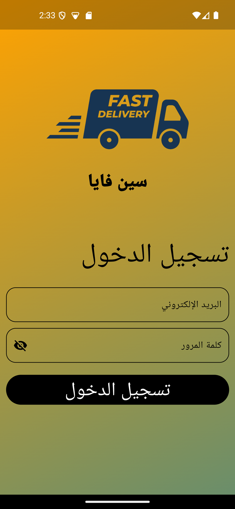
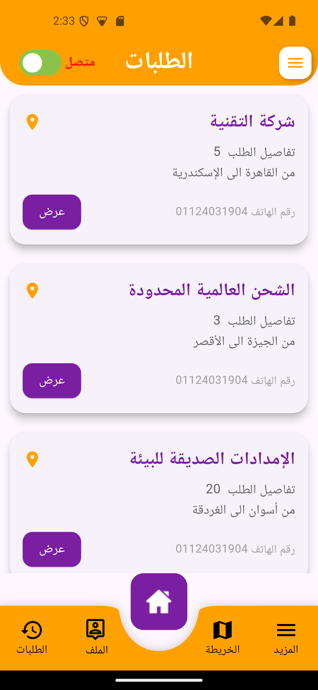
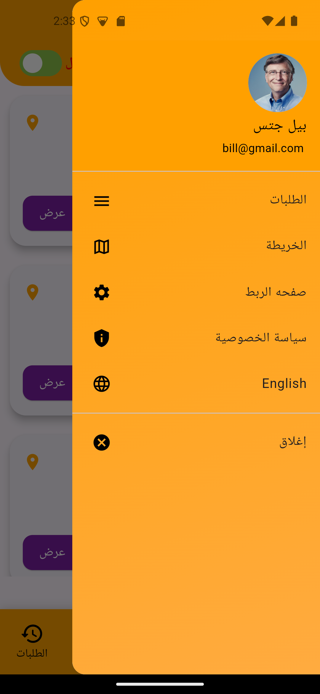
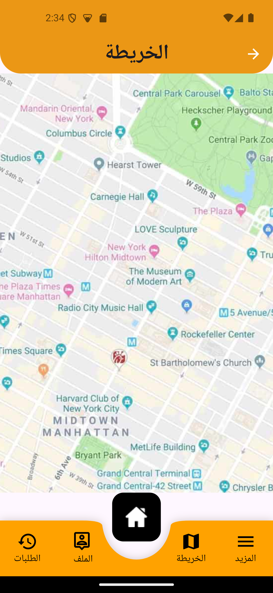
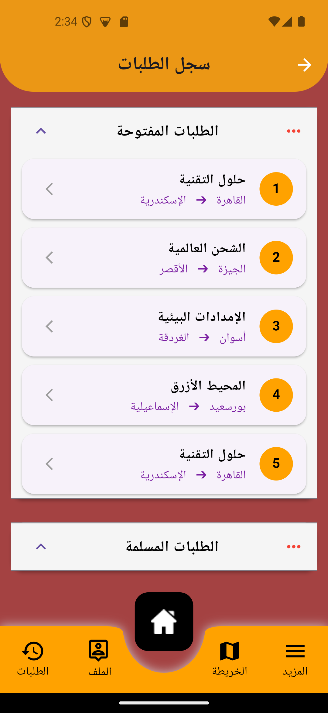
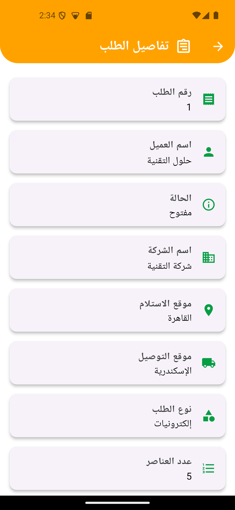
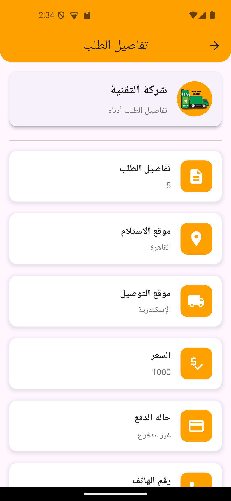
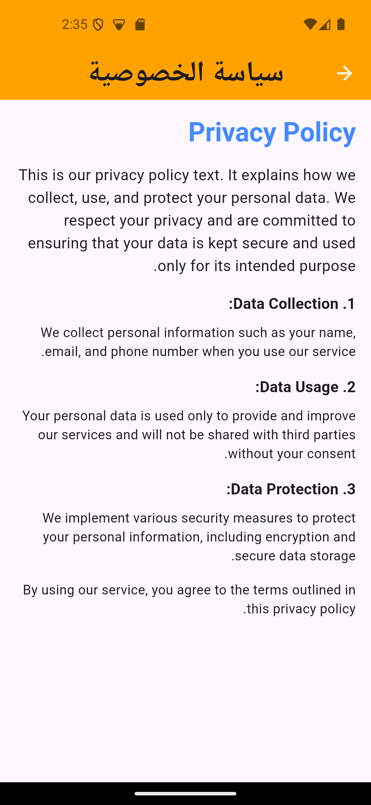

# 🚛 Synfya - Transport Management System

<p align="center">
  
</p>

<p align="center">
  <b>نظام متكامل لإدارة النقل والشحن - تطبيق للسائقين ومنصة ويب للشركات</b>
  <br>
  Complete Transport Management System - Driver Mobile App + Company Web Platform
</p>

<p align="center">
  
  
  
  
  
  
</p>

---

## 📱 عن المشروع

**Synfya** هو نظام متكامل لإدارة عمليات النقل والشحن يتكون من:

- 📱 **تطبيق موبايل للسائقين** (Flutter) - استلام الطلبات، عرض المسارات، إتمام التسليم
- 💻 **منصة ويب للشركات** - إدارة الطلبات، تتبع الشحنات، تقارير الأداء

تم تطويره باستخدام **Clean Architecture** و **BLoC** لضمان أعلى جودة وقابلية للتوسع.


## ✨ الميزات الرئيسية

### 👨‍✈️ تطبيق السائقين (Mobile App)

- ✅ **تسجيل الدخول الآمن** - باستخدام JWT tokens
- ✅ **لوحة تحكم السائق** - عرض الطلبات المتاحة والحالية
- ✅ **قبول/رفض الطلبات** - نظام قبول فوري
- ✅ **توجيهات خرائط** - Integration مع Google Maps API
- ✅ **تحديث الحالة** - استلام، في الطريق، تم التوصيل
- ✅ **إثبات التسليم** - رفع صور وتوقيع العميل
- ✅ **سجل الطلبات** - تاريخ جميع الطلبات السابقة
- ✅ **إشعارات فورية** - Firebase Cloud Messaging
- ✅ **تتبع الإيرادات** - عرض الأرباح والمكافآت

### 💼 منصة الشركات (Web Platform)

- ✅ **لوحة تحكم إدارية** - إدارة السائقين والطلبات
- ✅ **إنشاء طلبات الشحن** - إدخال بيانات المرسل والمستلم
- ✅ **تتبع الشحنات** - Live tracking على الخريطة
- ✅ **توزيع الطلبات** - نظام ذكي لتوزيع الطلبات على السائقين
- ✅ **تقارير الأداء** - إحصائيات ومخططات بيانية
- ✅ **إدارة الأسعار** - تحديد أسعار الشحن حسب المسافة
- ✅ **تقييم السائقين** - نظام تقييم بناءً على الأداء

---

## 🛠️ التقنيات المستخدمة

| التقنية | الغرض |
|---------|-------|
| **Flutter 3.16+** | تطوير التطبيق المتعدد المنصات |
| **Dart 3.2+** | لغة البرمجة |
| **BLoC / Cubit** | إدارة الحالة |
| **Clean Architecture** | فصل المسؤوليات وهيكلة المشروع |
| **GetIt + Injectable** | حقن التبعيات (DI) |
| **Dio + Retrofit** | استدعاءات API |
| **Google Maps API** | الخرائط والمسارات |
| **Firebase** | المصادقة، الإشعارات، التخزين |
| **Hive** | التخزين المحلي (Offline-first) |
| **GoRouter** | إدارة التنقل |
| **Flutter Bloc** | إدارة الحالة المتقدمة |

---

## 📸 لقطات الشاشة

### تطبيق السائقين
## 📸 لقطات الشاشة

### تطبيق سنفايا - واجهة السائقين

<div align="center">
  
  
  
  
  
  
  
  
  
  
</div>

---

### وصف اللقطات:

| الصورة | الوصف |
|--------|-------|
| `Screenshot_1734136392.png` | شاشة تسجيل الدخول - إدخال رقم الهاتف وكلمة المرور |
| `Screenshot_1734136424.png` | اللوحة الرئيسية - إحصائيات الطلبات اليومية |
| `Screenshot_1734136431.png` | قائمة الطلبات - الطلبات المتاحة والجديدة |
| `Screenshot_1734136447.png` | تفاصيل الطلب - معلومات المرسل والمستلم |
| `Screenshot_1734136458.png` | خريطة التتبع - عرض المسار الأمثل |
| `Screenshot_1734136462.png` | تأكيد الاستلام - إثبات التوصيل والتوقيع |
| `Screenshot_1734136468.png` | الملف الشخصي - بيانات السائق وإحصائياته |
| `Screenshot_1734136471.png` | الإشعارات - تنبيهات الطلبات الجديدة |
| `Screenshot_1734136473.png` | سجل الطلبات - تاريخ الطلبات السابقة |
| `Screenshot_1734136524.png` | تقييم السائق - نظام التقييم والمكافآت |

> *سيتم إضافة الصور قريبًا*

---

## 🚀 كيفية التشغيل

### المتطلبات الأساسية
```bash
Flutter SDK: 3.16.0 أو أحدث
Dart SDK: 3.2.0 أو أحدث
Android Studio / VS Code
Git
